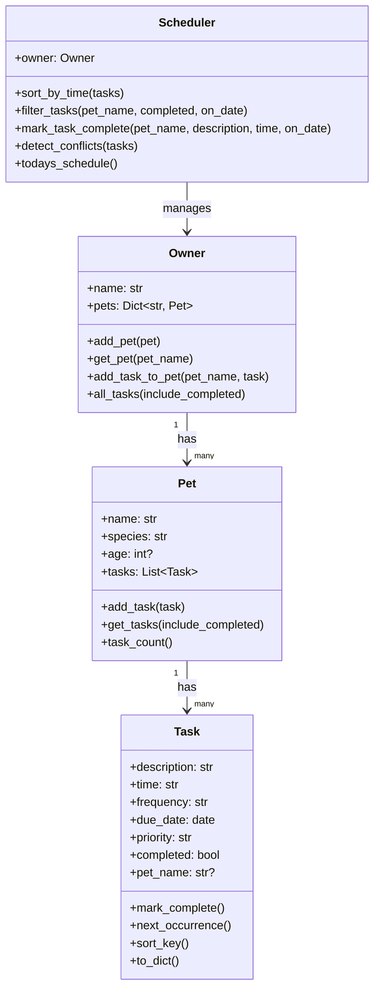

# PawPal+ (Module 2 Project)

PawPal+ is a smart pet care management system built with Python and Streamlit. It helps owners manage feedings, walks, medications, and appointments with scheduling logic that is easy to test and extend.

## Features

- OOP architecture with Owner, Pet, Task, and Scheduler classes.
- Add and manage multiple pets for one owner.
- Add tasks with due date, time, recurrence, and priority.
- Generate and view a clean, sorted daily schedule.
- Filter tasks by pet, completion status, and date.
- Detect task conflicts when two tasks share the same due date and time.
- Automatically create the next task for daily and weekly recurring tasks when marked complete.
- CLI-first demo script for backend verification.
- Automated pytest suite for core scheduler behavior.

## Project Structure

- `pawpal_system.py`: Logic layer with OOP models and scheduler algorithms.
- `main.py`: CLI demo script to verify functionality without UI.
- `app.py`: Streamlit UI connected to backend logic.
- `tests/test_pawpal.py`: Automated tests.
- `reflection.md`: Design and collaboration reflection.
- `uml_final.mmd`: Final Mermaid class diagram.

## Smarter Scheduling

The scheduler includes algorithmic features beyond basic CRUD:

- Sorting by chronological order using due date and HH:MM time parsing.
- Filtering by pet, completion state, and date.
- Lightweight conflict detection for exact date/time collisions.
- Recurrence automation for daily and weekly tasks.

Tradeoff: conflict detection checks exact time collisions only, not overlapping durations. This keeps the logic simple and fast for a first release.

## Running the App

### Setup

```bash
python -m venv .venv
source .venv/bin/activate  # Windows: .venv\Scripts\activate
pip install -r requirements.txt
```

### Run Streamlit UI

```bash
streamlit run app.py
```

### Run CLI Demo

```bash
python main.py
```

## Testing PawPal+

Run the test suite with:

```bash
python -m pytest
```

Current tests cover:

- Task completion status updates.
- Pet task addition behavior.
- Chronological sorting correctness.
- Recurrence behavior for daily tasks.
- Conflict warning detection for duplicate times.

Confidence Level: 4/5 stars.

## UML (Final)

Final Mermaid source is stored in `uml_final.mmd`.



## Demo

Add your final Streamlit screenshot in this section using your course image path when available.

```html
<a href="/course_images/ai110/your_screenshot_name.png" target="_blank"></a>
```
